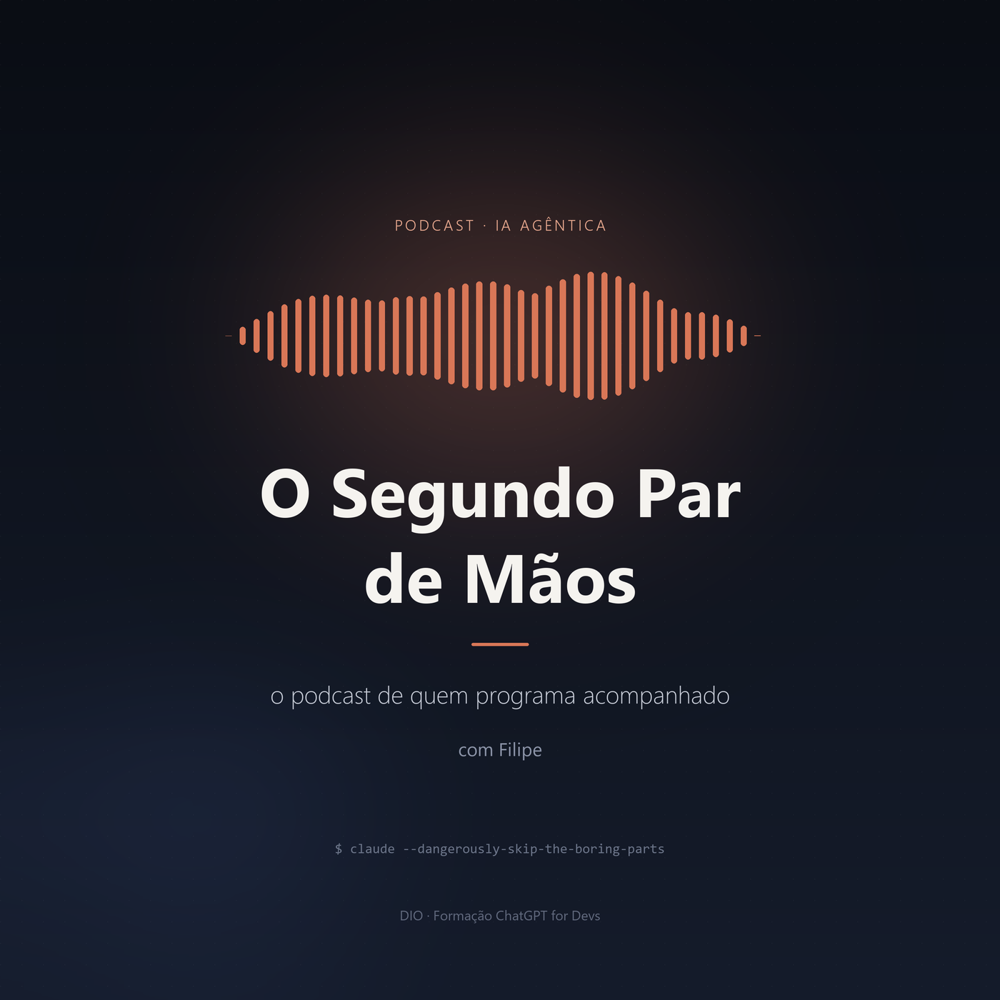

# DIO — Formação ChatGPT for Devs

Desafios de projeto da [DIO](https://www.dio.me) sobre uso de IA generativa na
produção de conteúdo técnico. Três desafios, o mesmo tema, formatos diferentes:
um **artigo**, um **e-book** e um **podcast** sobre IA agêntica na geração de código.

Nos três, a IA foi usada como **aceleradora** de um conteúdo que já existia — e o
resultado passou por edição humana antes de virar entregável.

---

## 🎙️ Podcast — *O Segundo Par de Mãos*

**o podcast de quem programa acompanhado** · episódio 01, 4 min 20 s

> **[Ouvir o episódio (mp3)](./podcast/output/podcast-editado.mp3)** ·
> [Sobre o podcast](./podcast/README.md) ·
> [Ler o roteiro](./podcast/roteiro/ep01-o-que-muda-quando-a-ia-executa.md)



*O que muda quando a IA executa* — a diferença entre uma inteligência artificial
que sugere e uma que executa, e o que isso muda na rotina de quem programa.

O episódio é **gerado por código**: `python podcast/src/gerar_podcast.py` produz
narração, trilha, mixagem e capa. A trilha lo-fi é sintetizada com numpy — livre de
direitos por construção — e a mixagem em ffmpeg faz a música recuar sozinha quando
a voz entra, algo que o passo a passo manual do módulo não faz.

### Prompts usados na produção do podcast

| Etapa | Arquivo | Conceito |
| --- | --- | --- |
| 1. Nicho e estratégia | [`01-nicho-e-estrategia.md`](./prompts/podcast/01-nicho-e-estrategia.md) | Posicionamento |
| 2. Nome do podcast | [`02-nome-do-podcast.md`](./prompts/podcast/02-nome-do-podcast.md) | Regras negativas |
| 3. Capa | [`03-capa.md`](./prompts/podcast/03-capa.md) | Prompt de imagem |
| 4. Roteiro | [`04-roteiro-do-episodio.md`](./prompts/podcast/04-roteiro-do-episodio.md) | Variáveis / blocos |
| 5. Narração | [`05-narracao.md`](./prompts/podcast/05-narracao.md) | Síntese de voz |
| 6. Edição e publicação | [`06-edicao-e-publicacao.md`](./prompts/podcast/06-edicao-e-publicacao.md) | Mixagem |

**Repositório de referência do expert:**
https://github.com/felipeAguiarCode/prompts-for-podcast-generate-by-ia

---

## 📕 E-book — *O Dev Aumentado*

**Claude Code na prática: da ideia ao commit** · 22 páginas

> **[Ler o e-book (PDF)](./ebook/o-dev-aumentado.pdf)** · [Sobre o e-book](./ebook/README.md)


A diferença entre uma IA que sugere e uma IA que executa — e o que muda no dia a
dia de quem programa quando ela ganha acesso ao repositório.

| # | Capítulo | Sobre |
| --- | --- | --- |
| 01 | Da sugestão à ação | O que muda quando a IA tem mãos |
| 02 | Onboarding | Entendendo uma base que você nunca viu |
| 03 | Ponta a ponta | Funcionalidade completa, com testes |
| 04 | Debugging | Da mensagem de erro à causa raiz |
| 05 | Refatoração | Mudanças mecânicas, em escala |
| 06 | Memória de projeto | Ensinando as regras do seu time |
| 07 | Acelerador | Não substituto |

O PDF é **gerado por código** — `python ebook/src/gerar_ebook.py` produz as 22
páginas a partir de um script versionado, sem PowerPoint no caminho.

### Prompts usados na produção do e-book

| Etapa | Arquivo |
| --- | --- |
| 1. Tema e público | [`01-definicao-tema-publico.md`](./prompts/ebook/01-definicao-tema-publico.md) |
| 2. Título poderoso | [`02-titulo-poderoso.md`](./prompts/ebook/02-titulo-poderoso.md) |
| 3. Capa | [`03-capa.md`](./prompts/ebook/03-capa.md) |
| 4. Estrutura de capítulos | [`04-estrutura-capitulos.md`](./prompts/ebook/04-estrutura-capitulos.md) |
| 5. Conteúdo dos capítulos | [`05-conteudo-capitulos.md`](./prompts/ebook/05-conteudo-capitulos.md) |
| 6. Blocos de código | [`06-blocos-de-codigo.md`](./prompts/ebook/06-blocos-de-codigo.md) |
| 7. Diagramação e regra dos 8 | [`07-diagramacao-regra-8.md`](./prompts/ebook/07-diagramacao-regra-8.md) |
| 8. Post do LinkedIn | [`08-post-linkedin.md`](./prompts/ebook/08-post-linkedin.md) |

**Repositório de referência do expert:**
https://github.com/felipeAguiarCode/prompts-recipe-to-create-a-ebook

---

## 📄 Artigo — *Claude: como a IA da Anthropic está acelerando o dia a dia dos desenvolvedores*

> **[Ler o artigo](./artigo/claude-acelerador-de-devs.md)**


De assistente de chat a parceiro de codificação: como o Claude saiu do uso via
chat e passou a atuar como agente dentro do fluxo de trabalho de times de
engenharia — lendo repositórios, editando arquivos e executando comandos.

> O artigo não foi publicado em plataforma externa — ele vive neste repositório.

**Checklist do desafio:** definir o assunto ✅ · headline ✅ · imagem de capa ✅ ·
blocos do artigo ✅ · call to action ✅

### Prompts usados na produção do artigo

| Etapa | Arquivo |
| --- | --- |
| 1. Definição do assunto | [`01-definicao-assunto.md`](./prompts/01-definicao-assunto.md) |
| 2. Título e headline | [`02-titulo-headline.md`](./prompts/02-titulo-headline.md) |
| 3. Imagem de capa | [`03-imagem-capa.md`](./prompts/03-imagem-capa.md) |
| 4. Blocos do artigo | [`04-blocos-artigo.md`](./prompts/04-blocos-artigo.md) |
| 5. Call to action | [`05-call-to-action.md`](./prompts/05-call-to-action.md) |

**Repositório de referência do expert:**
https://github.com/felipeAguiarCode/prompts-for-article-generate-by-ia

---

## Sobre as capas

As duas capas foram **desenhadas por código**, com Python + Pillow — não geradas
por modelo de difusão. A decisão e o prompt de referência do MidJourney estão
documentados em [`prompts/ebook/03-capa.md`](./prompts/ebook/03-capa.md).

```bash
pip install pillow
python imagens/gerar-capa.py        # capa do artigo
python ebook/src/gerar_ebook.py     # e-book completo + capa
python podcast/src/capa.py          # capa do podcast
```

---

## Ferramentas usadas

| Ferramenta | Uso |
| --- | --- |
| **Claude (Anthropic)** | Estruturação do conteúdo, documentação dos prompts e geração das artes |
| **ChatGPT** | Redação inicial dos textos |
| **Python 3.12 + Pillow** | Renderização das capas e diagramação do e-book |
| **edge-tts** | Narração do podcast com voz neural pt-BR |
| **numpy + ffmpeg** | Trilha sonora sintetizada e mixagem do episódio |

---

## Estrutura do repositório

```
.
├── ebook/                             # 📕 desafio do e-book
│   ├── o-dev-aumentado.pdf            #    o e-book (22 páginas)
│   ├── capa-ebook.png
│   ├── README.md
│   └── src/                           #    gerador: conteúdo + layout + montagem
├── artigo/                            # 📄 desafio do artigo
│   └── claude-acelerador-de-devs.md
├── podcast/                           # 🎙️ desafio do podcast
│   ├── output/podcast-editado.mp3     #    o episódio (4 min 20 s)
│   ├── capa-podcast.png
│   ├── roteiro/
│   ├── README.md
│   └── src/                           #    gerador: roteiro → voz → trilha → mix
├── imagens/
│   ├── capa-claude-devs.png
│   └── gerar-capa.py
├── prompts/
│   ├── 01..05-*.md                    #    prompts do artigo
│   ├── ebook/01..08-*.md              #    prompts do e-book
│   └── podcast/01..06-*.md            #    prompts do podcast
├── server/                            # API Node + OpenAI (desafio anterior)
└── web/                               # front-end React (desafio anterior)
```

---

*Projetos desenvolvidos como desafios da [DIO](https://www.dio.me) — Formação ChatGPT for Devs.*
