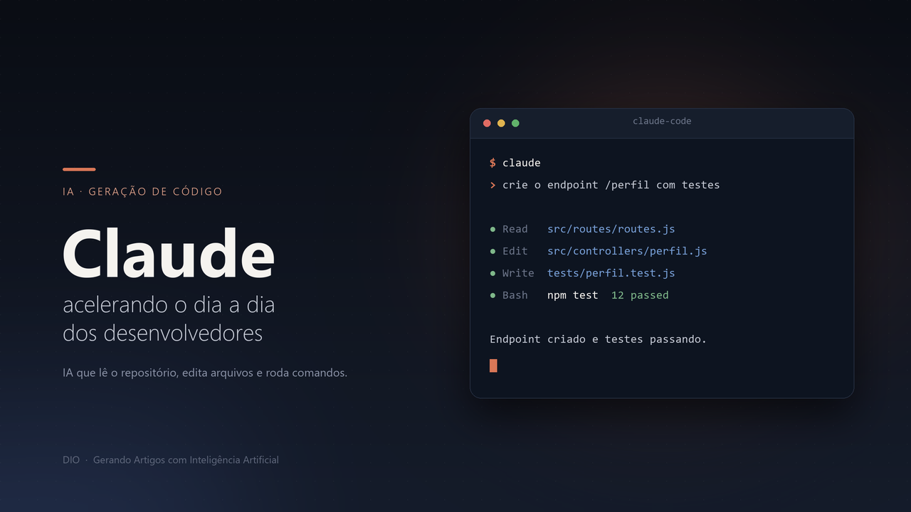

# Claude: como a IA da Anthropic está acelerando o dia a dia dos desenvolvedores

*De assistente de chat a parceiro de codificação: entenda como o Claude mudou a forma como devs escrevem, revisam e mantêm software.*

---

## O assunto: por que falar de Claude e geração de código agora?

Nos últimos anos, ferramentas de IA deixaram de ser "autocomplete inteligente" e passaram a atuar como colaboradores reais dentro do fluxo de trabalho de um time de engenharia. O Claude, criado pela Anthropic, é um dos protagonistas dessa mudança — não só como modelo de linguagem acessível via chat, mas como um agente capaz de ler um repositório inteiro, editar arquivos, rodar comandos e entender o contexto de um projeto complexo.

Este artigo explica, de forma prática, como o Claude é usado hoje para gerar código e acelerar o trabalho de desenvolvedores — do primeiro protótipo até a manutenção de sistemas em produção.

---

## Do chat ao terminal: a evolução do Claude para devs

O Claude começou como um modelo acessível via chat e API, útil para tirar dúvidas, explicar conceitos e gerar trechos de código sob demanda. Esse uso ainda é extremamente comum: um desenvolvedor descreve um problema em linguagem natural e recebe uma sugestão de implementação, testes ou explicação de um erro.

A grande virada para produtividade real veio com o **Claude Code**, uma ferramenta agêntica que roda diretamente no terminal, em editores como VS Code e JetBrains, no desktop e até no navegador. A diferença central é que o Claude Code não apenas *sugere* código: ele **lê o repositório**, entende a estrutura do projeto, edita arquivos, executa comandos de shell, gerencia fluxos de Git e pode se conectar a ferramentas externas via protocolos como o MCP (Model Context Protocol).

Na prática, isso significa pedir coisas como:

- "Crie um endpoint que retorna o perfil do usuário e escreva os testes."
- "Estou recebendo esse erro ao rodar a aplicação — encontre a causa no código e corrija."
- "Explique como funciona nosso sistema de autenticação e mostre os arquivos mais importantes."

E receber não uma resposta teórica, mas uma ação concreta sobre o próprio código.

---

## Como o Claude acelera o trabalho do desenvolvedor

### 1. Onboarding e entendimento de código legado
Entender uma base de código desconhecida costuma ser um dos pontos mais lentos de qualquer time. O Claude consegue varrer um repositório, mapear arquitetura, dependências e pontos de entrada, entregando em minutos um resumo que levaria horas para um humano montar sozinho.

### 2. Geração de funcionalidades ponta a ponta
Ao invés de escrever cada função manualmente, o desenvolvedor descreve o comportamento esperado e revisa o que o Claude propõe — implementação, testes e, muitas vezes, documentação básica já incluídos.

### 3. Debugging assistido
Um dos usos mais valiosos: colar um erro (ou apenas descrevê-lo) e deixar o Claude investigar a causa raiz dentro do código real, em vez de depender só de buscas genéricas na internet.

### 4. Refatoração e manutenção
Tarefas repetitivas — atualizar padrões, renomear estruturas, migrar bibliotecas — podem ser delegadas, liberando tempo do time para decisões de arquitetura e produto.

### 5. Memória de projeto com arquivos de contexto
Um recurso importante é a possibilidade de criar arquivos de instruções permanentes no próprio projeto, ensinando ao Claude as convenções, comandos de build e regras específicas daquele time — como se fosse um manual interno que a IA sempre consulta antes de agir.

---

## Claude como "acelerador", não substituto

Um ponto importante para qualquer artigo (ou conversa de corredor) sobre IA e programação: o Claude funciona melhor como **multiplicador de produtividade**, não como substituto do julgamento técnico do desenvolvedor. Ele executa ações diretamente no ambiente — edita arquivos, roda comandos, cria commits — o que exige revisão humana constante, controle de permissões e boas práticas de segurança, especialmente em pipelines de CI/CD ou ambientes com credenciais sensíveis.

O ganho real não está em "terceirizar" o pensamento, mas em **reduzir o tempo entre a ideia e o código funcional**, permitindo que o desenvolvedor gaste mais energia em arquitetura, produto e decisões difíceis — e menos em tarefas mecânicas.

---

## Conclusão

O Claude representa bem uma tendência mais ampla: IA deixando de ser só uma interface de perguntas e respostas para se tornar um agente que participa ativamente do ciclo de desenvolvimento de software. Para quem está construindo portfólio ou avaliando ferramentas para o time, entender essa diferença — entre "IA que sugere" e "IA que executa" — é essencial para tirar o máximo proveito dessas tecnologias com segurança.

---

### Call to action

Gostou deste artigo? 👉 Deixe nos comentários qual tarefa do seu dia a dia você gostaria de automatizar com IA, e compartilhe este post com alguém do seu time que ainda não experimentou o Claude Code. Se curtiu o conteúdo, siga para mais artigos sobre IA aplicada ao desenvolvimento de software!

---

*Artigo produzido como parte do desafio de projeto da DIO — "Gerando Artigos com Inteligência Artificial".*
