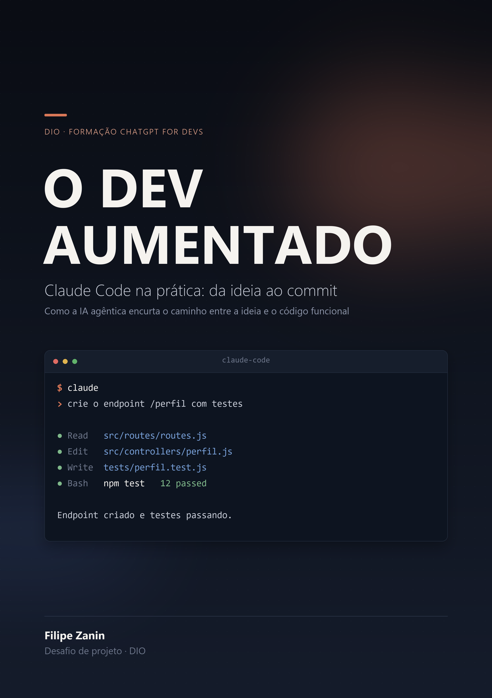

# O Dev Aumentado

**Claude Code na prática: da ideia ao commit** — 22 páginas sobre a diferença
entre uma IA que sugere e uma IA que executa.

📕 **[Ler o e-book (PDF)](./o-dev-aumentado.pdf)**



---

## Sumário

| # | Capítulo | Sobre |
| --- | --- | --- |
| 01 | Da sugestão à ação | O que muda quando a IA tem mãos |
| 02 | Onboarding | Entendendo uma base que você nunca viu |
| 03 | Ponta a ponta | Funcionalidade completa, com testes |
| 04 | Debugging | Da mensagem de erro à causa raiz |
| 05 | Refatoração | Mudanças mecânicas, em escala |
| 06 | Memória de projeto | Ensinando as regras do seu time |
| 07 | Acelerador | Não substituto |

---

## Como o PDF é gerado

Este e-book não foi montado no PowerPoint — ele é **desenhado por código**. Todas
as 22 páginas saem de um script Python versionado aqui.

```bash
pip install pillow
python ebook/src/gerar_ebook.py
```

Saída:

```
e-book gerado: ebook/o-dev-aumentado.pdf
capa gerada:   ebook/capa-ebook.png
páginas:       22
layout: nenhuma página estourou o limite
```

### Estrutura

```
ebook/
├── o-dev-aumentado.pdf     # o e-book
├── capa-ebook.png          # capa isolada
└── src/
    ├── conteudo.py         # os textos — só dados, nenhum desenho
    ├── layout.py           # os componentes de desenho
    └── gerar_ebook.py      # monta as páginas e escreve o PDF
```

A separação é deliberada: **para mudar um texto do e-book, você mexe só em
`conteudo.py`**. É a versão em código do que a aula ensina no PowerPoint —
montar os componentes uma vez e nunca editar a página de template.

### Requisitos

- Python 3.8+
- [Pillow](https://pypi.org/project/pillow/)
- Fontes **Segoe UI** e **Consolas** (padrão no Windows). Em Linux/macOS, ajuste
  o caminho em `_FONTES`, no topo de `layout.py`.

---

## As regras de design aplicadas

Todas vêm das aulas do desafio:

- **Regra dos 8 pontos** — corpo 32, subtítulo 48, título 64. Todos múltiplos de
  8, e o título com exatamente o dobro do corpo.
- **Pouco texto por página** — o e-book é lido no celular. O gerador avisa se
  alguma página passar do limite.
- **Paleta única** — uma cor de destaque só (coral `#D97757`), a mesma da capa do
  artigo, para os dois desafios lerem como um portfólio só.
- **Claro para ler, escuro para impactar** — páginas de conteúdo em off-white;
  capa, divisórias e página final em fundo escuro.

O detalhamento de cada decisão está em
[`prompts/ebook/07-diagramacao-regra-8.md`](../prompts/ebook/07-diagramacao-regra-8.md).

---

## Transparência

O texto foi **acelerado por IA e editado por um humano**, linha a linha. A capa
foi desenhada por código, não gerada pelo MidJourney — o motivo e o prompt de
referência estão em [`prompts/ebook/03-capa.md`](../prompts/ebook/03-capa.md).

Num e-book cujo argumento central é *não confie cegamente no output de uma IA*,
publicar conteúdo não revisado seria uma contradição difícil de explicar.
